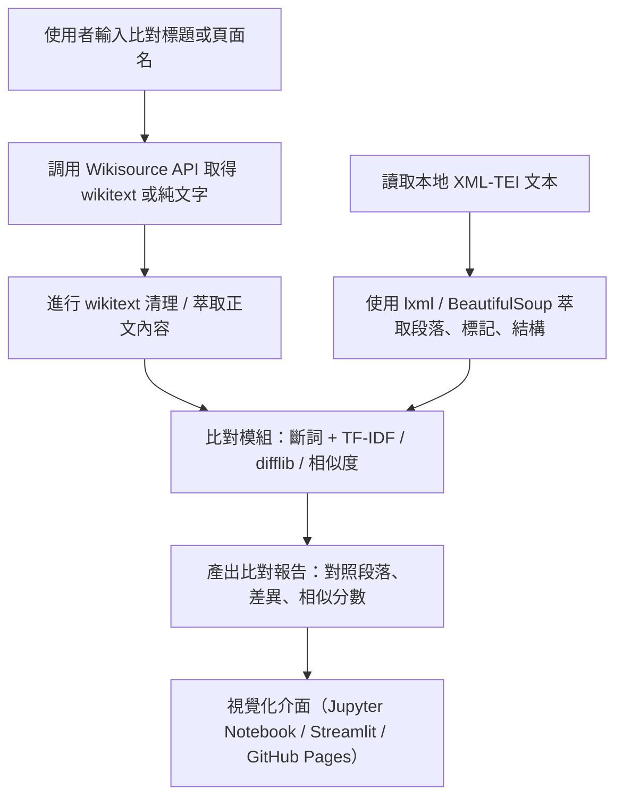
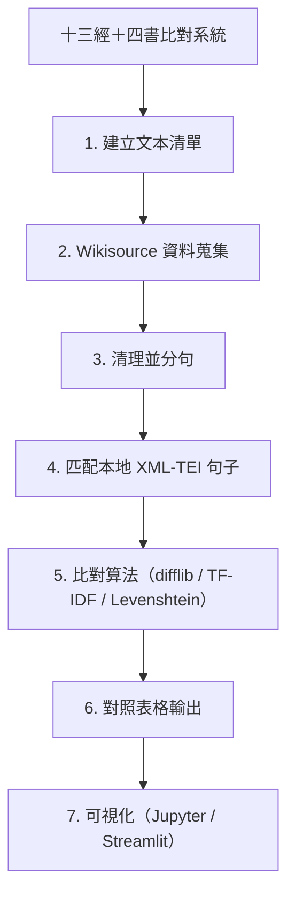

# comparing text workflow

```mermaid

graph TD

A[使用者輸入比對標題或頁面名] --> B[調用 Wikisource API 取得 wikitext 或純文字]
B --> C[進行 wikitext 清理 / 萃取正文內容]

D[讀取本地 XML-TEI 文本] --> E[使用 lxml / BeautifulSoup 萃取段落、標記、結構]

C --> F[比對模組：斷詞 + TF-IDF / difflib / 相似度]
E --> F

F --> G[產出比對報告：對照段落、差異、相似分數]

G --> H[視覺化介面（Jupyter Notebook / Streamlit / GitHub Pages）]
```
## 經部為例

```mermaid
graph TD

A[十三經＋四書比對系統] --> B[1. 建立文本清單]
B --> C[2. Wikisource 資料蒐集]
C --> D[3. 清理並分句]
D --> E[4. 匹配本地 XML-TEI 句子]
E --> F[5. 比對算法（difflib / TF-IDF / Levenshtein）]
F --> G[6. 對照表格輸出]
G --> H[7. 可視化（Jupyter / Streamlit）]
```
